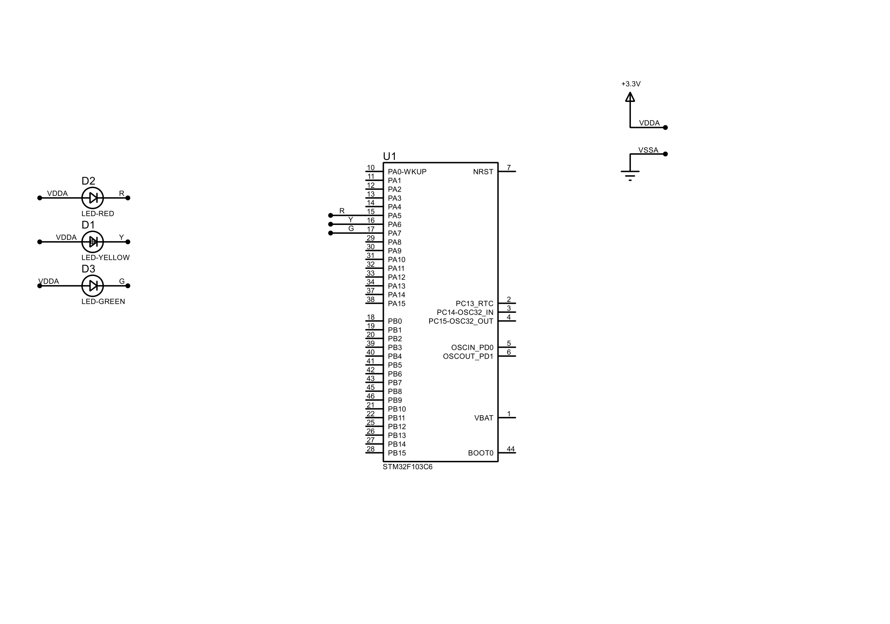

# Lab 1 Report
All the exercises use the timer interrupt with the specifications below 

```c
  htim2.Instance = TIM2;
  htim2.Init.Prescaler = 7999;
  htim2.Init.CounterMode = TIM_COUNTERMODE_UP;
  htim2.Init.Period = 9;
```
### Exercise 1 
***Schematic*** 


***Source code***
```c
void LED_Setup(uint32_t redOnTime, uint32_t yellowOnTime, uint32_t greenOnTime)
{
    if (interruptTime > 0)
    {
        redOnCounter 	= redOnTime 	* millisecondConversion 	/ interruptTime;
        yellowOnCounter = yellowOnTime 	* millisecondConversion 	/ interruptTime;
        greenOnCounter 	= greenOnTime 	* millisecondConversion 	/ interruptTime;
    }
}

void LED_Alternating(void)
{
    static uint32_t dynamicRedCounter 		= 0;
    static uint32_t dynamicYellowCounter 	= 0;
    static uint32_t dynamicGreenCounter 	= 0;
    switch (status)
    {
    case RED:
        if (++dynamicRedCounter < redOnCounter)
        {
            status = RED;
            Turn_On_Red();
            Turn_Off_Yellow();
            Turn_Off_Green();
        }
        else
        {
            status = YELLOW;
            dynamicRedCounter = 0;
        }
        break;
    case YELLOW:
        if (++dynamicYellowCounter < yellowOnCounter)
        {
            status = YELLOW;
            Turn_On_Yellow();
            Turn_Off_Red();
            Turn_Off_Green();
        }
        else
        {
            status = GREEN;
            dynamicYellowCounter = 0;
        }
        break;

    case GREEN:
        if (++dynamicGreenCounter < greenOnCounter)
        {
            status = GREEN;
            Turn_On_Green();
            Turn_Off_Red();
            Turn_Off_Yellow();
        }
        else
        {
            status = RED;
            dynamicGreenCounter = 0;
        }
        break;
    default:
    	break;
    }
}
```
```c
LED_Setup(2, 2, 0);
while (1)
{
    /* USER CODE END WHILE */
    /* USER CODE BEGIN 3 */
  }
void HAL_TIM_PeriodElapsedCallback(TIM_HandleTypeDef *htim){
	LED_Alternating();
}
```
Full source code can be found [here](./src/ex1/Core)
### Exercise 2 

***Schematic*** 



***Source code***
```c 
LED_Setup(5, 2, 3);
void HAL_TIM_PeriodElapsedCallback(TIM_HandleTypeDef *htim){
	LED_Alternating();
}
```
### Exercise 3 
***Schematic*** 


***Source code***

Same source code as exercise 2

### Exercise 4 and Exercise 5
***Schematic*** 


***Source code***

7_segment.c

```c
static GPIO_TypeDef * segmentPort[NUMBER_OF_SEGMENT] =
{
		SEG_A_GPIO_Port,
		SEG_B_GPIO_Port,
		SEG_C_GPIO_Port,
		SEG_D_GPIO_Port,
		SEG_E_GPIO_Port,
		SEG_F_GPIO_Port,
		SEG_G_GPIO_Port
};

static uint16_t segmentPin[NUMBER_OF_SEGMENT] =
{
		SEG_A_Pin,
		SEG_B_Pin,
		SEG_C_Pin,
		SEG_D_Pin,
		SEG_E_Pin,
		SEG_F_Pin,
		SEG_G_Pin
};

static uint8_t referCode[10] = {0x40, 0x79, 0x24, 0x30, 0x19, 0x12, 0x02, 0x78, 0x00, 0x10};
static uint8_t internalCounter = 0;

void Display_Number(uint8_t codeIndex){
	for (uint8_t index = 0; index < NUMBER_OF_SEGMENT; index++){
		Data_Out(segmentPort[index], segmentPin[index], (referCode[codeIndex] >> index & 0x01));
	}
}

void Seg_Setup(uint8_t counter){
	if (counter < 0 || counter >= DECIMAL_COUNTER) return;
	internalCounter = counter;
}

void Display_7Seg(void){
	if (internalCounter <= 0){
		Display_Number(0);
	}
	else {
		Display_Number(internalCounter);
		internalCounter--;
	}
}
```

led_modify.c
```c
// same as the source code in exercise 2, separated by header and source file from main
```

software_timer.h
```c
#define TIMER_DELAY   1000
#define TIMER_INTERRUPT   10
```

software_timer.c
```c
int timerCounter = 0;
int timerFlag = 0;

void Set_Timer(void){
	timerCounter = TIMER_DELAY/TIMER_INTERRUPT;
	timerFlag 	 = 0;
}

void Timer_Run(void){
	if(timerCounter > 0){
		timerCounter--;
		if(timerCounter <= 0){
			timerFlag = 1;
		}
	}
}
```

main.c

```c
LED_Setup(2, 2, 2);
Seg_Setup(9);
  /* USER CODE END 2 */

  /* Infinite loop */
  /* USER CODE BEGIN WHILE */
Set_Timer();
while (1)
{
  if(timerFlag == 1){
	  Set_Timer();
	  LED_Alternating();
	  Display_7Seg();
  }
    /* USER CODE END WHILE */
    /* USER CODE BEGIN 3 */
}
  
void HAL_TIM_PeriodElapsedCallback(TIM_HandleTypeDef *htim){
	Timer_Run();
}
```


### Exercise 6 to Exercise 10
***Schematic*** 


***Source code***
gpio.c
```c
static uint16_t clockPin[ANALOG_CLOCK_NUMBER] =
{
		ONE_HR_Pin,
		TWO_HR_Pin,
		THREE_HR_Pin,
		FOUR_HR_Pin,
		FIVE_HR_Pin,
		SIX_HR_Pin,
		SEVEN_HR_Pin,
		EIGHT_HR_Pin,
		NINE_HR_Pin,
		TEN_HR_Pin,
		ELEVEN_HR_Pin,
		TWELVE_HR_Pin
};

static GPIO_TypeDef * clockPort[ANALOG_CLOCK_NUMBER] =
{
		ONE_HR_GPIO_Port,
		TWO_HR_GPIO_Port,
		THREE_HR_GPIO_Port,
		FOUR_HR_GPIO_Port,
		FIVE_HR_GPIO_Port,
		SIX_HR_GPIO_Port,
		SEVEN_HR_GPIO_Port,
		EIGHT_HR_GPIO_Port,
		NINE_HR_GPIO_Port,
		TEN_HR_GPIO_Port,
		ELEVEN_HR_GPIO_Port,
		TWELVE_HR_GPIO_Port
};
void Turn_On_Led(uint8_t pos){
	if (pos < 0 || pos >= ANALOG_CLOCK_NUMBER) return;
	HAL_GPIO_WritePin(clockPort[pos], clockPin[pos], ENABLE);
}
void Turn_Off_Led(uint8_t pos){
	if (pos < 0 || pos >= ANALOG_CLOCK_NUMBER) return;
	HAL_GPIO_WritePin(clockPort[pos], clockPin[pos], DISABLE);
}
void State_Display(uint8_t pos, uint8_t state){
	if (pos < 0 || pos >= ANALOG_CLOCK_NUMBER) return;
	HAL_GPIO_WritePin(clockPort[pos], clockPin[pos], state);
}
void Clock_Display(uint8_t buffer[], uint8_t size){
	for (uint8_t index = 0; index < size; index++){
		HAL_GPIO_WritePin(clockPort[index], clockPin[index], buffer[index]);
	}
}
```

clock_manip.c
```c
static uint8_t clockBuffer[ANALOG_CLOCK_NUMBER] =
{
		DISABLE,
		DISABLE,
		DISABLE,
		DISABLE,
		DISABLE,
		DISABLE,
		DISABLE,
		DISABLE,
		DISABLE,
		DISABLE,
		DISABLE,
		DISABLE
};

void Check_Clock(void){
	static uint8_t index 	= 0;
	clockBuffer[index] 		= ENABLE;
	for (uint8_t tempIndex = 0; tempIndex < ANALOG_CLOCK_NUMBER; tempIndex++){
		if (tempIndex != index)
			clockBuffer[tempIndex] = DISABLE;
	}
	Clock_Display(clockBuffer, ANALOG_CLOCK_NUMBER);
	index = (index + 1) % ANALOG_CLOCK_NUMBER;
}
void Clear_All(void){
	for (uint8_t tempIndex = 0; tempIndex < ANALOG_CLOCK_NUMBER; tempIndex++){
		clockBuffer[tempIndex] = DISABLE;
	}
	Clock_Display(clockBuffer, ANALOG_CLOCK_NUMBER);
}
void Set_All(void){
	for (uint8_t tempIndex = 0; tempIndex < ANALOG_CLOCK_NUMBER; tempIndex++){
		clockBuffer[tempIndex] = ENABLE;
	}
	Clock_Display(clockBuffer, ANALOG_CLOCK_NUMBER);
}
void Set_Number(uint8_t number){
	Clear_All();
	if (number < 0 || number >= ANALOG_CLOCK_NUMBER) return;
	clockBuffer[number] = ENABLE;
	Clock_Display(clockBuffer, ANALOG_CLOCK_NUMBER);
}
void Clear_Number(uint8_t number){
	if (number < 0 || number >= ANALOG_CLOCK_NUMBER) return;
	clockBuffer[number] = DISABLE;
	Clock_Display(clockBuffer, ANALOG_CLOCK_NUMBER);
}
void Display_Time(uint8_t hour, uint8_t minute, uint8_t second){
	if 	(hour < 0 || hour >= 2*HOUR_LIMIT
			|| minute < 0 || minute >= MINUTE_LIMIT
			|| second < 0 || second >= SECOND_LIMIT) return;
	clockBuffer[hour % HOUR_LIMIT]  	= ENABLE;
	clockBuffer[minute / CLOCK_LOD] 	= ENABLE;
	clockBuffer[second / CLOCK_LOD] 	= ENABLE;
	Clock_Display(clockBuffer, ANALOG_CLOCK_NUMBER);
}
```

main.c 
```c
  Set_Timer();
  Clear_All();
  //Set_Number(10);
  Display_Time(0, 10, 30);
  while (1)
  {
	  if (timerFlag == 1){
		  Set_Timer();
		  //Clear_Number(10);
		  //Check_Clock();
	  }
    /* USER CODE END WHILE */

    /* USER CODE BEGIN 3 */
  }
  /* USER CODE END 3 */
}
```
